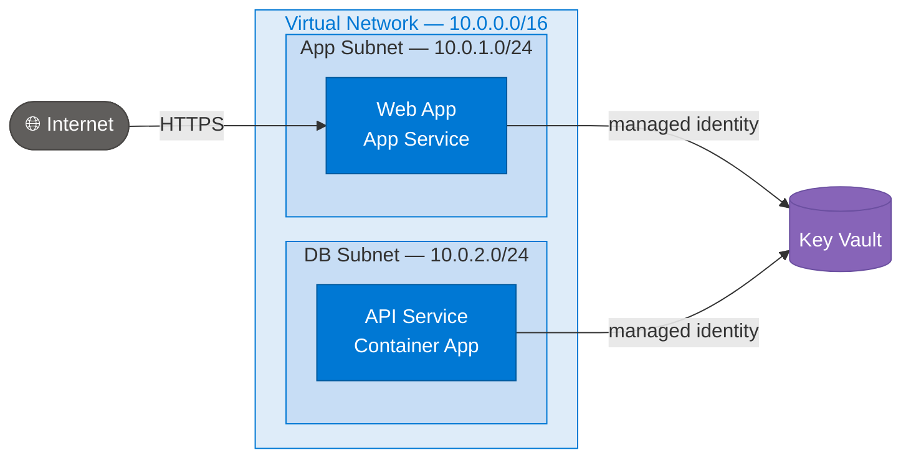

```mermaid
graph LR
    Internet(["🌐 Internet"]):::external

    subgraph VNet["Virtual Network — 10.0.0.0/16"]
        subgraph AppSubnet["App Subnet — 10.0.1.0/24"]
            WebApp["Web App\nApp Service"]:::compute
        end
        subgraph DbSubnet["DB Subnet — 10.0.2.0/24"]
            CA["API Service\nContainer App"]:::compute
        end
    end

    KV[("Key Vault")]:::secrets

    Internet -->|HTTPS| WebApp
    WebApp -->|managed identity| KV
    CA -->|managed identity| KV

    classDef compute fill:#0078d4,stroke:#005a9e,color:#fff
    classDef secrets fill:#8764b8,stroke:#6b4fa0,color:#fff
    classDef external fill:#605e5c,stroke:#484644,color:#fff

    style VNet fill:#deecf9,stroke:#0078d4,color:#0078d4
    style AppSubnet fill:#c7ddf5,stroke:#0078d4,color:#323130
    style DbSubnet fill:#c7ddf5,stroke:#0078d4,color:#323130
```
