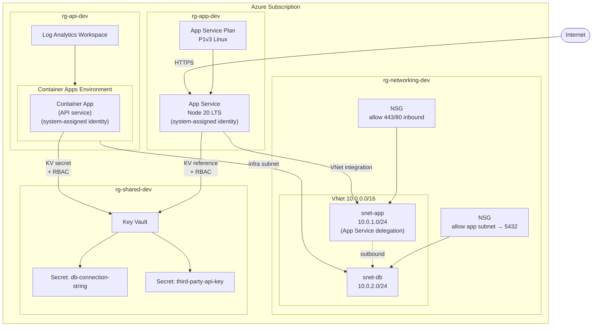

```mermaid
graph TD
    Internet(["Internet"])

    subgraph Azure["Azure Subscription"]
        subgraph RG_Net["rg-networking-dev"]
            AppNSG["NSG\nallow 443/80 inbound"]
            DbNSG["NSG\nallow app subnet → 5432"]

            subgraph VNet["VNet 10.0.0.0/16"]
                AppSubnet["snet-app\n10.0.1.0/24\n(App Service delegation)"]
                DbSubnet["snet-db\n10.0.2.0/24"]
            end

            AppNSG --> AppSubnet
            DbNSG --> DbSubnet
        end

        subgraph RG_Shared["rg-shared-dev"]
            KV["Key Vault"]
            SecretDB["Secret: db-connection-string"]
            SecretAPI["Secret: third-party-api-key"]
            KV --> SecretDB
            KV --> SecretAPI
        end

        subgraph RG_App["rg-app-dev"]
            ASP["App Service Plan\nP1v3 Linux"]
            WebApp["App Service\nNode 20 LTS\n(system-assigned identity)"]
            ASP --> WebApp
        end

        subgraph RG_API["rg-api-dev"]
            LogWS["Log Analytics Workspace"]
            subgraph CAE["Container Apps Environment"]
                CA["Container App\n(API service)\n(system-assigned identity)"]
            end
            LogWS --> CAE
        end
    end

    Internet -->|HTTPS| WebApp
    WebApp -->|VNet integration| AppSubnet
    AppSubnet -.->|outbound| DbSubnet
    CAE -->|infra subnet| DbSubnet
    WebApp -->|KV reference\n+ RBAC| KV
    CA -->|KV secret\n+ RBAC| KV
```
