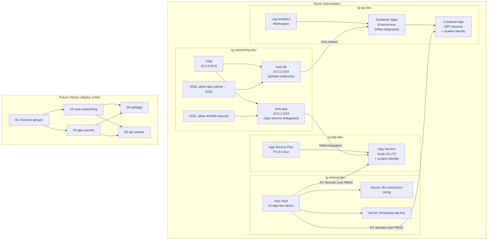

```mermaid
graph TD
    subgraph Azure["Azure Subscription"]
        subgraph RG_Net["rg-networking-dev"]
            VNet["VNet\n10.0.0.0/16"]
            AppSubnet["snet-app\n10.0.1.0/24\n(App Service delegation)"]
            DbSubnet["snet-db\n10.0.2.0/24\n(private endpoints)"]
            AppNSG["NSG: allow 443/80 inbound"]
            DbNSG["NSG: allow app subnet → 5432"]
            VNet --> AppSubnet
            VNet --> DbSubnet
            AppNSG --> AppSubnet
            DbNSG --> DbSubnet
        end

        subgraph RG_Shared["rg-shared-dev"]
            KV["Key Vault\nkv-app-dev-demo"]
            SecretDB["Secret: db-connection-string"]
            SecretAPI["Secret: third-party-api-key"]
            KV --> SecretDB
            KV --> SecretAPI
        end

        subgraph RG_App["rg-app-dev"]
            ASP["App Service Plan\nP1v3 Linux"]
            WebApp["App Service\nNode 20 LTS\n+ system identity"]
            ASP --> WebApp
        end

        subgraph RG_API["rg-api-dev"]
            LogWS["Log Analytics\nWorkspace"]
            CAE["Container Apps\nEnvironment\n(VNet-integrated)"]
            CA["Container App\n(API service)\n+ system identity"]
            LogWS --> CAE
            CAE --> CA
        end
    end

    %% Stack reference edges (cross-stack dependencies)
    AppSubnet -->|VNet integration| WebApp
    DbSubnet -->|infra subnet| CAE
    KV -->|KV Secrets User RBAC| WebApp
    KV -->|KV Secrets User RBAC| CA

    %% Pulumi stacks legend
    subgraph Stacks["Pulumi Stacks (deploy order)"]
        S1["01 resource-groups"]
        S2["02 core-networking"]
        S3["03 app-secrets"]
        S4["04 webapp"]
        S5["05 api-service"]
        S1 --> S2
        S1 --> S3
        S2 --> S4
        S3 --> S4
        S2 --> S5
        S3 --> S5
    end
```
